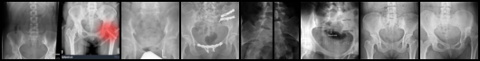
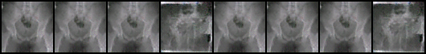

# DCGANs_Infected_SI_joint_Images
Using DCGANs to generate X-ray images of Sacroiliac joints infected by some kind of arthiritis. 
This is still work in progress. 

***Ground-truth samples:***

***Generated_samples:***

I have less than 70 ground truth samples. I had to augment the data-set by replication and data-generator. The quality of the images generated are not of the highest quality yet. This is still `work in progress`.

`Comit details are in:https://bitbucket.org/dashboard/overview`
